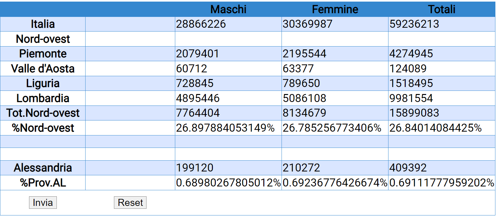

# maschifemmine

A fun PHP exercise, in italian! Sorry to anybody English looking at this ^^  
 - These are the inputs that they user is allowed to fill
  
### The exercise 💪  
 - In this exercise after you input Italy's total male and female population numbers then you have to put the male and female population specific to each of the regions on the left (Piemonte, Valle d-Aosta, Liguria, Lombardia, Alessandria)
 -  Clculate the region's totals individually and output it to their right in 'Totali'
 -  Sum the region's totals together and output it in 'Tot. Nord-ovest'
 -  Calculate the region's % compared to the Italian population overall
 -  Compare the Alessandria's total population as a % compared to the Nord-ovest population.

### Finished Exercise should look like this  
Forgive the no spacing between the large numbers like the previous picture, that was the preview our teacher made in excel 😅
And for not adding a cap to the floating numbers, that was just laziness from my part. At that time I was speedrunning like sonic through these exercises and probably had already moved on to a more exciting one ^^
Btw, to add a cap when outputting a float type variable you do so with the number format property of PHP:
```php
$number = 12.3456789;
$limitedNumber = number_format($number, 2); // Limit to 2 decimal places

echo $limitedNumber; // Output: 12.35
```
  
