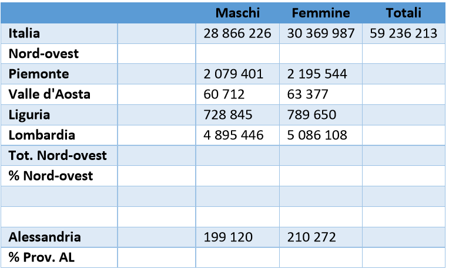

# maschifemmine

A fun PHP exercise, in italian! Sorry to anybody English looking at this ^^  
These are the inputs that they user is allowed to fill

In this exercise after you input Italy's total male and female population numbers then you had to put the male and female population specific to each of the regions on the left (Piemonte, Valle d-Aosta, Liguria, Lombardia, Alessandria) and calculate their totals individually and outputting it on their right in 'Totali', then sum their totals together and outputting it in 'Tot. Nord-ovest' and calculate their % compared to the Italian population overall and then compare the Alessandria's total population as a % to the Nord-ovest population.
